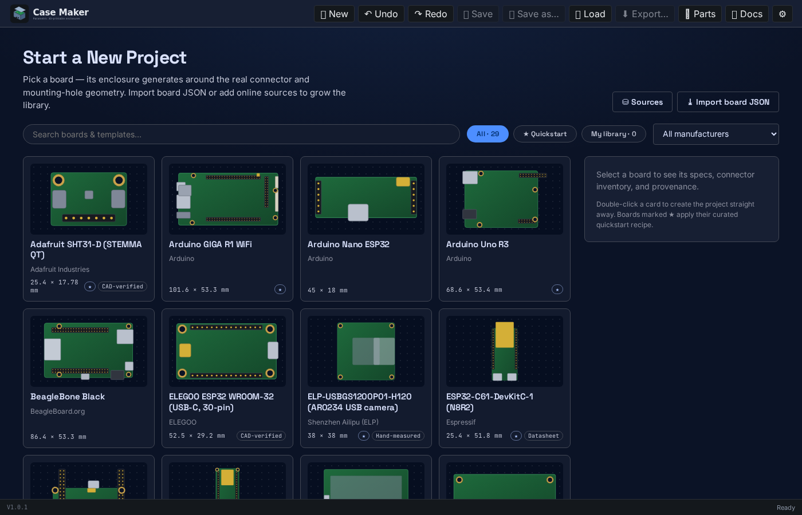
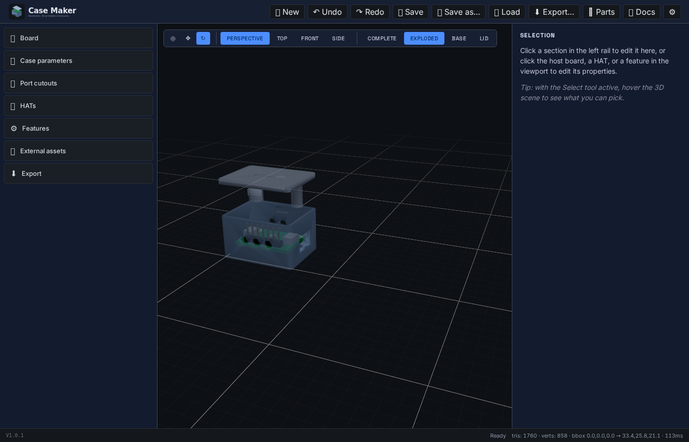

# Case Maker

**Design a 3D-printable enclosure for your circuit board in your browser — free, no signup, no install.**

Pick a board, and Case Maker generates a parametric case around its *real* connector and mounting-hole geometry: wall cutouts land exactly where the USB ports are, bosses land exactly on the holes. Tweak walls, lids, joints, vents, snaps, hinges, and stands with live 3D feedback, then export production-ready STL / 3MF straight into your slicer.

### ▶ Try it now: **[electricrv.ca/casemaker](https://electricrv.ca/casemaker)**

[](https://electricrv.ca/casemaker)

## What it does

- **29 built-in board profiles** — Raspberry Pi (3B/3B+/4B/5/Zero 2W/Pico), Arduino (Uno, GIGA, Nano ESP32), ESP32 devkits, 4.3" touch-panel modules, QuinLED controllers, Teensy, Jetson Nano, BeagleBone, micro:bit, M5Stack, sensor breakouts, USB cameras — each schema-validated with a manufacturer source URL, most measured from vendor CAD.
- **A community board library** you can enable with one click ([casemaker-library](https://github.com/SlyWombat/casemaker-library)), plus import/export of board-profile JSON and support for any number of online board sources.
- **Quickstart templates** — one click from board to a curated, print-tested case recipe (vented sensor pods, touch-panel bezels, desk stands, wall mounts, DMX controllers, a Pelican-style latched case…).
- **Real-time parametric editing** — every slider rebuilds the case in ~50 ms via Manifold WASM CSG on a worker thread.
- **Joints & retention:** flat, snap-fit (auto-placed catches), and screw-down lids; screwless board retention with two-jaw snap clips for hole-less boards; heat-set-insert-aware bosses.
- **Automatic port cutouts** for USB-C/A/B, micro-USB, HDMI/micro-HDMI, barrel jack, RJ-45, SD, ribbon cables, antennas — per-port toggles and custom cutouts.
- **Beyond boxes:** display bezels, desk stands and snap-on wall mounts for finished panel modules, piano hinges, cam latches, TPU gaskets, rugged ribbing, fan mounts, ventilation patterns.
- **External STL/3MF import** with reference / subtract / union — drop a fan grille STL, mark it *subtract*, watch it carve the shell.
- **STL (binary/ASCII) + 3MF export**, print-ready or assembled layout; schema-versioned project save/load; full undo/redo. Fully client-side — your designs never leave your machine. Also ships as a Windows desktop app.

[](https://electricrv.ca/casemaker)

## Add your board

The library grows by contribution, and provenance is taken seriously (dimensions come from vendor CAD or calipers — not squinted off datasheets).

**Easiest way:** point Claude Code at the community library's agent playbook and it will set up the toolchain, interview you about your board, author + validate the profile, help you test it in the live app, and open the PR:

```
claude "Fetch https://raw.githubusercontent.com/SlyWombat/casemaker-library/main/AGENT.md and follow it to help me contribute my board"
```

Prefer to do it by hand? See [casemaker-library](https://github.com/SlyWombat/casemaker-library#contributing-a-board). Boards a maintainer has physically print-verified get a **✓ printed** badge in the picker.

## Documentation

- [Getting Started](casemaker-app/src/docs/getting-started.md) — zero-to-printed-case walkthrough (also in the in-app 📖 Docs viewer).
- [User Manual](casemaker-app/src/docs/user-manual.md) — every panel, parameter, joint, and export option.
- [Technical Reference](casemaker-app/src/docs/technical-reference.md) — module API, coordinate system, board-profile format.
- [Changelog](CHANGELOG.md) · [Contributing](CONTRIBUTING.md)

## Run it locally

```bash
cd casemaker-app
npm ci
npm run dev          # Vite dev server (http://localhost:8000)
npm test             # Vitest unit suite
npm run test:e2e     # Playwright E2E suite
npm run build        # production web bundle
npm run tauri:build  # Windows/macOS/Linux desktop installer (needs Rust)
```

**Stack:** TypeScript (strict) · React 19 · Vite · three.js / react-three-fiber · Manifold-3d WASM CSG in a Web Worker · Zustand + Immer + zundo · Tauri 2 desktop wrapper. Architecture rule: the parametric `Project` JSON is the single source of truth; rendered geometry is derived state, recomputed in the worker on every change. Full tour in the [Technical Reference](casemaker-app/src/docs/technical-reference.md).

### Desktop / LAN

The desktop build embeds a small HTTP server (default port `8000`, configurable in Settings). `casemaker.exe --bind-all` exposes it to your LAN — trusted networks only. `--port N` and `--print-config` are also available.

## Contributing

Bug reports, board profiles, and PRs are all welcome — see [CONTRIBUTING.md](CONTRIBUTING.md) for the issue-first bug workflow, code style, and test-suite contract, and [good first issues](https://github.com/SlyWombat/CaseMaker/issues?q=is%3Aissue+is%3Aopen+label%3A%22good+first+issue%22) for places to start.

## License

License terms are still being finalized. Contact `dave@drscapital.com` for usage questions.
